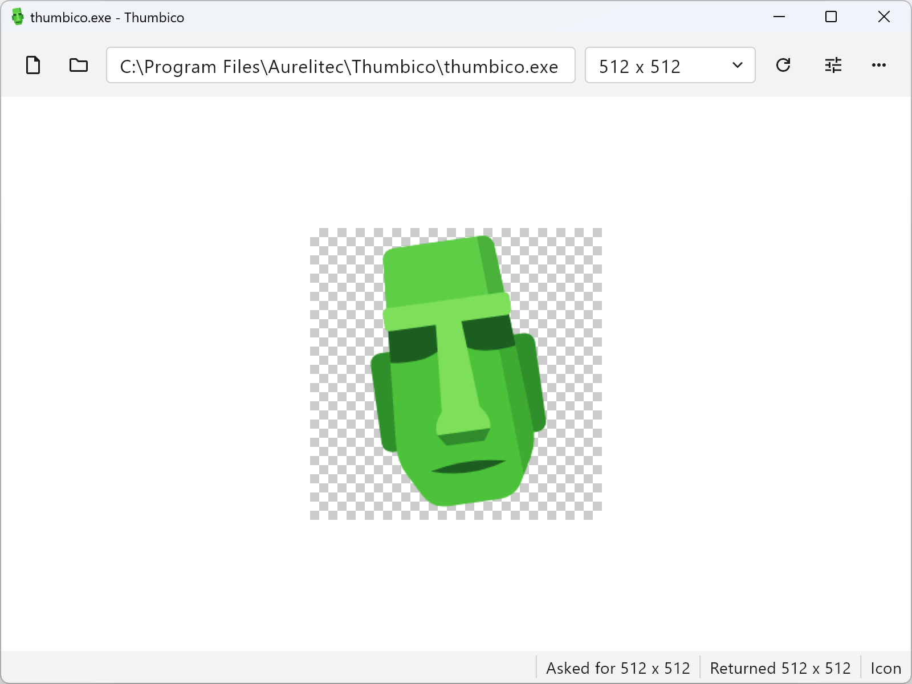

#  Thumbico

[](https://github.com/aurelitec/thumbico/releases)
[](#download)
[](https://flutter.dev/)
[](LICENSE)
[](https://github.com/aurelitec/thumbico/releases)

**See any file the way Windows sees it.**

Windows makes a thumbnail or an icon for every file, folder, and drive on your PC, but shows it only at a few fixed sizes. Thumbico asks for it at the size you choose and shows exactly what comes back, pixel for pixel. It is the same image Explorer draws, not a copy made by another program.

- Grab a program's icon at its largest size for an article, a slide, or a web page.
- See what a document, photo, or video thumbnail really looks like at 512 or 1024 pixels.
- Check how your own icon or thumbnail handler behaves at every size.

<picture>
  <source media="(prefers-color-scheme: dark)" srcset="repo-assets/screenshots/thumbico-dark.png">
  
</picture>

## Features

- **Any item** - files, folders, drives, and shell locations such as `shell:Downloads`. Drop one on the window, open it, or paste its path, quotes from Explorer's "Copy as path" included.
- **Any size** - type a size, square or not, pick one of the shell's own sizes from 16 to 2048, or step up and down with Ctrl+plus and Ctrl+minus.
- **Thumbnail or icon** - ask for the best image, a thumbnail only, or an icon only, and turn the shell's own rendering options on and off. Every change reads again at once.
- **Real pixels** - one image pixel per screen pixel, or the display's scale, as Explorer draws it.
- **Save and copy** - save as PNG, ICO, JPEG, BMP, or GIF, with transparency kept in PNG and ICO, or copy to the clipboard.
- **Showcase mode** - hide everything but the image, ready for a screenshot.
- **At home on Windows** - light and dark theme following Windows, the keyboard shortcuts Windows apps share, and a window that opens where you left it.
- **Private** - no account, no ads, no telemetry.

## Download

[](https://github.com/aurelitec/thumbico/releases/download/v2.0.0/Thumbico-2.0.0-windows-x64-setup.exe)
[](https://github.com/aurelitec/thumbico/releases/download/v2.0.0/Thumbico-2.0.0-windows-x64-portable.zip)

Both files and the release notes are on [GitHub Releases](https://github.com/aurelitec/thumbico/releases/latest):

- **Setup** (`...-setup.exe`) - installs for you alone without administrator rights, or for all users.
- **Portable** (`...-portable.zip`) - extract it anywhere, such as a USB drive; its settings stay beside it.

Requires Windows 10 or Windows 11, 64-bit.

Thumbico is not code-signed, so Windows SmartScreen may warn about it the first few times it is downloaded. Choose **More info**, then **Run anyway**.

## Quotes

> "Thumbico is a combination of an icon extraction and viewing tool, with a thumbnail viewer and creator." ([BetaNews](https://betanews.com/article/extract-icons-and-create-image-thumbnails-with-thumbico/))

> "Thumbico is ideally suited as a tool for creating slideshows, preparing presentations, and any use case that requires display sizes outside standard Windows presets." ([Dr. Windows](https://www.drwindows.de/news/software-vorstellungen/thumbico), translated from German)

> "The simplicity of the application is its greatest strength, in my opinion. To load an image, just drag and drop it onto the main interface of the application." ([AddictiveTips](https://www.addictivetips.com/windows-tips/thumbico-lets-you-view-extract-icons-of-files-videos-applications/))

> "There are plenty of ways to extract the icons of the files on your computer, but Thumbico makes the entire process really easy. It is capable of pulling out the icon of any sort of file you feed it." ([Softpedia](https://www.softpedia.com/reviews/windows/Thumbico-Review-181397.shtml))

> "A useful program for users who want to customize icons on the operating system and developers who want to test how icons look on different sites and save icons in various resolutions." ([gHacks](https://www.ghacks.net/2012/01/30/view-and-extract-file-icons-with-thumbico/))

> "I really like this thumbnail extractor software. It is user-friendly, and extracting thumbnails of desktop shortcuts, EXE files, or some other application is very simple." ([TechwareGuide](https://web.archive.org/web/20220703135111/https://www.techwareguide.com/extract-thumbnail-desktop-shortcuts-exe-as-jpg-png-images-thumbico/))

> "Final verdict: Thumbico is nice and simple software. All the features are, collectively, very helpful and make thumbnails and icons look much more attractive and clear." ([I Love Free Software](https://www.ilovefreesoftware.com/17/windows/image-photo/thumbnail-viewer-display-thumbnails-icons-resize.html))

[More reviews](https://www.aurelitec.com/thumbico/reviews/)

## Built with Flutter

Thumbico 2.0 is a Flutter desktop app, written in Dart and themed to feel at home on Windows.

- **Real windows** - the About box is a true modal Windows dialog, made with Flutter's experimental multi-window API.
- **A shell engine in pure Dart** - `packages/thumbico_core` asks the Windows shell for the image through `IShellItemImageFactory`, using [`win32`](https://pub.dev/packages/win32) and FFI, off the UI isolate. It has no Flutter dependency.
- **Settings in one file** - `packages/simple_app_settings` keeps the settings in a single JSON file, beside the program for a portable copy or in the user's profile for an installed one.
- **A little C++** - taking files dropped on the window is the one feature written outside Dart, about 60 lines in the Windows runner.

## Building from source

You need Windows 10 or 11 (64-bit), Visual Studio with the **Desktop development with C++** workload, and the **main channel** of the Flutter SDK. The main channel is required because the app uses a prerelease Dart SDK and the experimental windowing API.

```powershell
flutter config --enable-windowing   # once per machine; a build made without it fails at start
flutter pub get
flutter run -d windows
flutter test
```

The two packages have tests of their own: run `dart test` in `packages/thumbico_core` and `packages/simple_app_settings`.

To make the release packages, use PowerShell 7:

```powershell
./distribution/make_release.ps1   # clean build, then both packages
```

The steps also run on their own: `build_release.ps1` builds, and `portable/make_portable.ps1` and `installer/make_installer.ps1` pack the existing build into `build/portable/` and `build/installer/`. The installer needs Inno Setup 7.1.

## History

Thumbico started in 2011 as a small C# and .NET app for Windows, and reached version 1.5 in 2015.

Thumbico 2.0 is a rewrite from scratch in Flutter, with a new look, a new icon, and a new engine.

## Contributing

Found a bug or have an idea? [Open an issue](https://github.com/aurelitec/thumbico/issues/new). If you'd like to fix it yourself, fork the repo, make your change, and open a pull request. You can also [write to Aurelitec](https://www.aurelitec.com/support/).

## License

Thumbico is open source under the [MIT License](LICENSE).

---

Made with 💚 in Oradea, Romania  
https://www.aurelitec.com
